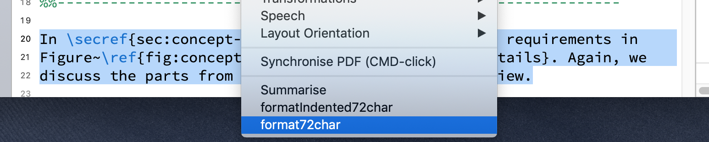
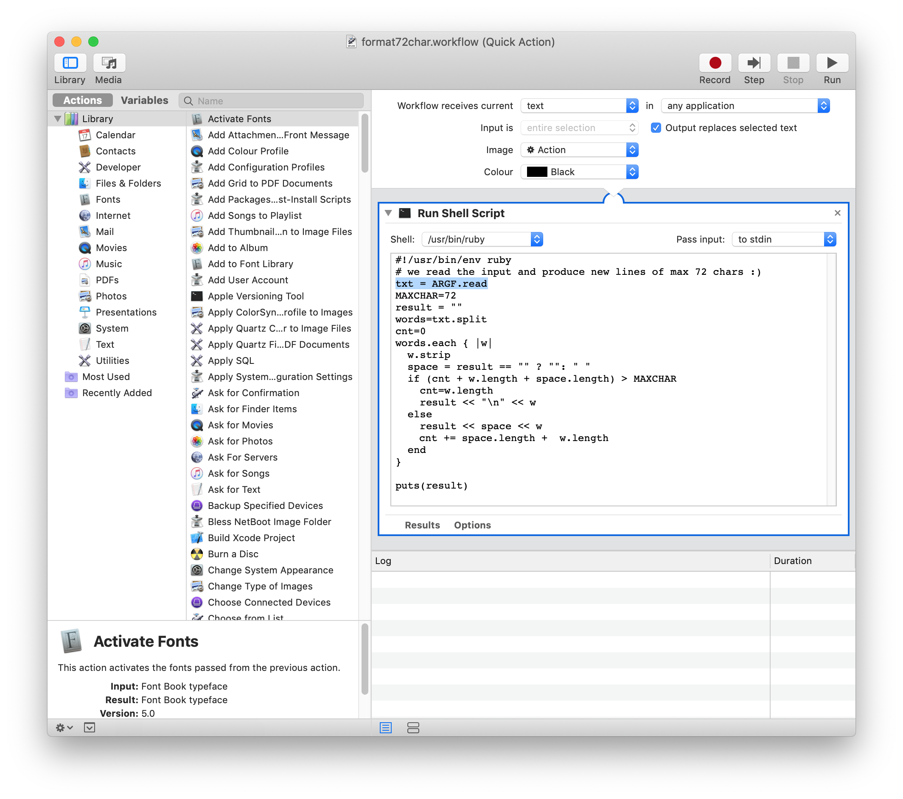

[Home](./README.md)

LaTeX Writing Hints
===================

* Format of you LaTeX source code:
	
	* always use **2 spaces** (not tabs) for indentation!
	
	* better use **fixed line length of max. 72 chars**.
	
	* LaTeX **comments ```%``` per line** only (better not within line)
	
	* **References**:
	
		better use new ```\parencite``` and ```\citetitle```  and ```cite``` and ```textcite``` (avoid old: ```\citet```, ```\citep```).
		
		multiple refs ```\cite{krug,krieg,krag}```
	
	* for "special" spelling ALWAYS use {}
	{libgit2}, {PixiJS}, ...
	
	* naming files: try to use minus (```-```) instead of "```_```" underline for all filenames.
	
	* define commands (Makros) to be used with figures. 
		
		e.g. 
		
		```\halfheight``` and ```\thirdheight```
   
   * **Listings:**

   		setings global for the listings in ```\lstset```
   		
   		set options such as [float=tp]
   		
  		do not use within itemize
  
  		use label ```lst:something```
   
   		for code right in the text, use ```\lstinline{}```
   
   		use caption for listings: 
   		
   		```
   		caption={[UsabML Report Structure]%
      	enhances...},
      	```
   
   
	* **Figures:**
		
		
		display at top bottom or page (not here ```[h]``` )
		
		```
	 		figure}[tbp]
	 	```
	 	
		size-settings:
	 	
	 	```
	 		width=\hsize
	 		keepaspectratio
	 	```
	 	
	 	for maximal bound values:
		
		```
			height=\halfheight  (or: thirdheight...)
		```
		
		center
	 	
	 	```
	 		\centering 
		```
		
		use font verdana (not helvetica)
		
		export as svg for rework

		refer figures within text 	use non-breaking space 
		
		```
		see Figure~\ref{fig:myfig2}
		```

* Appendix

	appendix: no Text/Title after ```\appendix``` 

* use your personal custom **macros** 

	* for example for naming a term such as a title of a button on a user interface

	define
	
	```
	\newcommand{\uiname}[1]{{\sffamily{#1}}} 
	```
	
	use
	
	```
	click \uiname{Inspect} to ... 
	```
	
	or for XML documents: ```\uuvalue```,  ```\uutag```, ```\uuattr```


* captions

	put ```\label{...}``` at the lower part of a figure entry to make captions for figures/listings/tables appear at the bottom!

* items

	items, itemize
    begin with sentence above and **COLON:**
    ... its benefits and limitations:
    ```\begin{itemize}```
    
    
* for papers (maybe not for a thesis) avoid footnotes

	better add references
	
	
	
* Never let an URL in the footnote span multiple pages... all text "in between" will become a link. UUHH

	
* References

	multiple refs ```\cite{Nielsen:1992,Nielsen:1993,Krug:2011}```
	
	always add Chapter/Section/Listing/Table with references. E.g.
	
	```
	see Section~\ref{..}   
	```
	Not: ``` see \ref{..}```
	
	
* Abbreviations in full lenght the first time
	* use ```\gls{..}``` 
	
	
* Filenames
	* avoid underscores (not very visible)
	* better use "-" (MINUS)
	* some editors show underlined
	
	
* avoid footnotes
	* better put references (urls) in biblio 
	
	
* Figures: 
	* use short caption for table of figures (TOF)
	* capitalise the short captions !!
	
	
	
	
Check Bibliography Enties 
=========================

* bib file ok?

	* check data model with ```biber --validate_datamodel tmp/*.bcf``` 

	* run e.g.: 
	```
	biber --validate_datamodel tmp/*.bcf |egrep -v "undefined" |grep WARN |sort -k 9|uniq |grep lastchecked
	```

* Check entries / Fields of an entry
	
	
	* Check entry "edition":
		* "1 edition" not necessary, only 2,3,4, ...
		* never user \nth{7} ... 7 is ok 
		* \nth{..} will be added by the biblio/style automatically
	
	* Check [mandatory bib entry fields](http://bib-it.sourceforge.net/help/fieldsAndEntryTypes.php)	( [alternative list of fields](http://mirror.easyname.at/ctan/macros/latex/contrib/biblatex/doc/biblatex.pdf) )	(e.g.: not valid fields such as "lastchecked" <= urldate would be ok)
	
	* specify/use BOTH: 
		* ISBN 10 and ISBN 13 	
		* search for existing ISBN <https://isbnsearch.org/isbn/145036179X>
		* check format of ISBN <http://www.isbn-check.de>

		    
		+ isbn (WITHOUT ```-```) (NOT: ```isbn       = "0-201-50932-6"```)
    		+ use converter at <https://www.isbn.org/ISBN_converter> or <http://www.isbn.org/converterpub.asp>
    		+ for example ```isbn       = "0201509326",```
	
	* "normalize" wrong entries such as Month = {Oct}, to **Month = oct**
	
	* Do not use ```@electronic`` <= this is just an ALIAS
	
		use ```@ONLINE``` (if necessary = no author given use publisher for company/group/team whatever as "author")
	
		For example: online resources (see: biblatex) 
			(NOT: ```@url{Nielsen:1995b{...}```) with NEW entry type: "ONLINE" and field: "URL"
		
		```latex
			@online{Nielsen:1995b,
       		author     = "Jakob Nielsen",
       		title      = "10 Usability Heuristics for User Interface Design",
       		year       = 1995,
       		url        = "http://www.nngroup.com/articles/ten-usability-heuristics/",
       		urldate    = "1995-01-01",
      		}
      	```
      
    	see: <http://mirror.easyname.at/ctan/macros/latex/contrib/biblatex/doc/biblatex.pdf> "online"
    
    	Required fields: ```author/editor,title,year/date,url``` 
    
    	Optional ```fields:
                subtitle,titleaddon,language,version,note,
                organization, date, month, year, addendum, pubstate, urldate```
	
	
	* ```url``` shorten all urls (if possible)

		OLD: https://www.perl.com
		
		NEW: https:/perl.com/
	
	
	* ```edition```: 
		* NOT: "second", "third" ALWAYS: "2", "3" => 2nd Edition
		* no FIRST Editions ```\nth{1}``` necessary
	
	* ```date```: The "date" field replaces year and month 

		iso formatted ( instead of year and month) 
    
    	+ e.g. ```2010-05```
   	 	+ e.g. ```2011```
    	+ e.g. ```2016-09-11```
    
    	```number``` und ```date``` in Hochkomma ""
    	
    	+ ```number     = "4",```
    	+ ```date       = "1997",```

    	
   * ```pagetotal``` for total number of pages
         
         
   * ```series```  Bib-field for conference title: e.g.  

		```"INFOVIS 1997"``` or ```"CHI EA 1998"```

		```


	* ```inproceedings``` city of conf e.g. Atlanta, Georgia, USA
	
		OLD: ```location```
		NEW: ```venue```
		
		compare: CTAN / biblatex:

		...**venue**.....location of a conference, 
					a symposium, or some
					other event in @proceedings 
					and @inproceedings entries. 
		
		...**location**.... list holds the place of publication.
		 			It therefore corresponds to the publisher 
					and institution lists.


	* remove unused info for books/authors
	
		such as: forword by => __
	
		such as: MacMillian Publishing Co. Inc. => ```Macmillian Publishing```
	
		such as: Morgan Kaufmann Publishers => ```Morgan Kaufmann```
	
		such as: In Proc. => ```Proc```

	* ```title``` field

		No underscores ```_``` (must be escapeed,  you must use ```\_```, otherwise you get hard to find errors and it will NOT COMPILE)

* **Superscript** 1st, 2nd, 3rd, etc. 

    in *.tex file: (not: ```4\textsuperscript{th}```):
        better
        
    ```
    \usepackage[super]{nth}   % 1st, 2nd, 3rd, etc.
    ```

    in *.bib file, e.g.: 
    
    ```Proc.\ \nth{4}```
        
    
    ```
    booktitle  = "Proc.\ \nth{4} International Conference 
                  on Human-Centered Software Engineering (HCSE 2012)",
    ```

* Do not use abbreviations for journal names, write full names of 
 
	OLD: {IEEE} Trans. Software Eng.
	
	NEW: {IEEE} Transactions on Software Engineerin


* Avoid too much information
	
	OLD: "Springer Verlag", "Addison-Weseley professional"
	
	NEW: "Springer", "Addison-Weseley"

* Write full names of States/Countries
	
	OLD: Seattle, WA, USA
	
	NEW: Seattle, Washington, USA

* URLs

	NO links to portal ACM => better use **DOI**s
	
	keep **URL**s short

	* shorten the urls by NOT using www WHENEVER POSSIBLE e.g.
		+ OLD: http://www.software-quality-days
		+ NEW: http://software-quality-days
			
	* add trailling / if no resource given:
		+ OLD: http://pyhton.org
		+ NEW: http://pyhton.org/
	
	* BOTH .. url trailling end, if possible remove www
		+ ALT: http://www.fsf.org
		+ NEU: http://fsf.org/ 	
	
* Encoding

	e.g.: 	UTF encoded: (NICHT:  Krist{\'\i}n L{\'a}rusd{\'o}ttir")
    		Kristín Lérusdóttir        
    
    		Ili{\'{c}} atja{\v{z}}
     


* Check bibliography creation for duplicate entries (if you used multiple *.bib files)

	```
	# we assume the tool 'pdflatex' created the auxiliary files in folder 'tmp' when compiling mylatexdoc.tex:
	# pdflatex -output-directory tmp mylatexdoc
	biber --output_directory tmp mylatexdoc | grep WARN | sort
	```


Biblio Styles
-------------

* use a bibliographoy-style (bst) which can 
	+ show **OID**s
	+ clickable URLs
	


Sidenote for Mac-TeXPad Users
=============================

* Customise your workflows: create an **Automator service** to **reformat text** (e.g. max line length of 72 chars) and assign shortcuts (e.g. ```ALT-CMD-*```)





```
#!/usr/bin/env ruby
# we read the input and produce new lines of max 72 chars :)
txt = ARGF.read
MAXCHAR=72
result = ""
words=txt.split
cnt=0
words.each { |w|
  w.strip
  space = result == "" ? "": " "
  if (cnt + w.length + space.length) > MAXCHAR
    cnt=w.length
    result << "\n" << w
  else
    result << space << w
	cnt += space.length +  w.length
  end
}

puts(result)
```


## Consistency

Throughout the document, check for consistent format!

* Do the tables look the same 
	* headers: ```\emph{...}```
	* header separated ```\hline\hline```
	* 	

* format all "special" terms:
	* toolname ```\toolname{PMD}```
	*  

* Section and Chapter references:
	* use ```See \secref{``` instead of ```See Section~\ref{```
	* use ```\chapref{chap:introduction}```


BUGFIXING / Compiling:
======================


### Fixing LaTeX Warnings / Errors

* For example, to fix error ```Missing number, treated as zero.```: 
	
	```
	<to be read again> 
                   \relax 
	l.244 ...hy[heading=bibintoc,title={Bibliography}]
	```
	
	=>	FIX/REASON: ```\nth{19th}``` instead of ```\nth{19}```
	
	=>	FIX/REASON: ```\nth{}1``` instead of ```\nth{1}```


### Biber Bug Fixing

It turned out that an error might occur when first invoking ```biber```. If this is
the case then remove the temporary files cached by biber. This can be done with the script ```9_cleanup.sh```, which

* finds the folder where Biber stores these files, with the command
	```biber --cache```

* and then removes the folder whose name starts with "par-"

See <http://texwelt.de/wissen/fragen/3272/biber-data-source-not-found>, <http://tex.stackexchange.com/questions/140814/biblatex-biber-fails-with-a-strange-error-about-missing-recode-data-xml-file>


## Final checks

* Urls: In the final pdf document click on each and every url to check if the links are ok. E.g. <https://iit.fh-joanneum.at/> should be written as:

	```
	\url{https://iit.fh-joanneum.at/}
	```


NOTES
----

Find this document at <https://git-iit.fh-joanneum.at/iit/latex-thesis-template/-/blob/master/README-Scientific-Working.md>.

