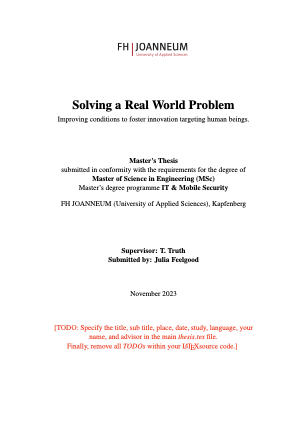

# LaTeX Template 

Templates for Exposé, Bachelor's and Master's Thesis at FH JOANNEUM, IIT. Optionally, you might check out the [Typst template](https://git-iit.fh-joanneum.at/iit/typst-thesis-template).

# For Your Exposé 
See [expose](./expose/) subfolder.

# For Your Bachelor's or Master's Thesis


Find the official requirements for a thesis online in Moodle in the *Secretary* section of  
[ITM](https://elearning.fh-joanneum.at/course/view.php?id=1193), [SWD](https://elearning.fh-joanneum.at/course/view.php?id=1194), [MSD](https://elearning.fh-joanneum.at/course/view.php?id=1947), [IRM](https://elearning.fh-joanneum.at/course/view.php?id=1196) and [IMS](https://elearning.fh-joanneum.at/course/view.php?id=1195).

Mind the documents by *Daniela Holzer*:

* English: Instructions and Guidelines for Composing Examination and Degree Papers (*instructions for composing degree papers_Oktober2019.pdf*)

* German: Richtlinien und Leitfaden für Das Verfassen Von Prüfungs- und Abschlussarbeiten (*Richtlinien Prüfungs-  u   Abschlussarbeiten.pdf*) 

Preview
-------

[](example-pdf/thesis_ims.pdf)


You might take a look at example PDFs: 

* English Versions for a Master's Thesis [IMS](thesis/example-pdf/thesis_ims.pdf), [IRM](thesis/example-pdf/thesis_irm_en.pdf) and Bachelor's Thesis [SWD](thesis/example-pdf/thesis_swd_en.pdf), [ITM](thesis/example-pdf/thesis_itm_en.pdf), [MSD](thesis/example-pdf/thesis_msd_en.pdf)

* German Versions for for a Master's Thesis [IRM](thesis/example-pdf/thesis_irm_ge.pdf) and Bachelor's Thesis [SWD](thesis/example-pdf/thesis_swd_ge.pdf), [ITM](thesis/example-pdf/thesis_itm_ge.pdf), [MSD](thesis/example-pdf/thesis_msd_ge.pdf)

Quick-Setup
-----------

1 clone this repo 

 	git clone git@git-iit.fh-joanneum.at:iit/latex-thesis-template.git mythesis
 	cd mythesis/thesis
	
### TL;DR

2 create temporary directory and run pdf creation using the bash script and view the output ```thesis.pdf```:

	./0_run_all_typeset.sh 	

### Step-by-step


2 compile: **pdflatex** (compile latex source files ```*.tex``` and find citations), **biber** (format bib-entries from file ```thesis.bib``` for cited references found in the latex source), **pdflatex** (compile latex again, now with formatted bib entries included) to final ```tmp/thesis.pdf```:

	# create tmp directories and subdirectories
 	mkdir -p tmp/chapters

	# compile thesis.tex (and included chapters/*.tex files)
	pdflatex --output-directory tmp thesis
 	
 	# generate pretty bibliography entries for references needed
 	biber tmp/thesis.bcf
 	
 	# combine latex text and bibliography 
 	pdflatex --output-directory tmp thesis
 	
3 view pdf 

	open tmp/thesis.pdf
	
4 add your text and your biblio

 	vi thesis.tex  
 	vi thesis.bib
 	
5 recompile: pdflatex,biber,pdflatex

 	pdflatex --output-directory tmp thesis
 	biber tmp/thesis.bcf 	
 	pdflatex --output-directory tmp thesis
 	
6 view modified pdf
	
	open tmp/thesis.pdf

7 go on with step 4


Instructions
------------

Quick, minimal instructions can be found in the [README](thesis/README.md).


Quick-Links
-----------

* LaTeX Crash Course and many more resources <https://git-iit.fh-joanneum.at/iit/LaTeX-Crash-Course>


* [Scientific Working Hints](README-Scientific-Working.md): "use your spellchecker, ..."

* [LaTeX Writing Hints](README-LaTeX-Writing.md): "indentation with spaces not tabs, ..."


* Einreichung: [Anleitung für Einreichung an der FH JOANNEUM](https://wissen.fh-joanneum.at/joanneumonline/studierende/abschlussarbeit/wie-kann-ich-meine-abschlussarbeit-einreichen-2/)


NOTES
----

* 2022 Changes: Formal declaration removed from document.


Find this document at <https://git-iit.fh-joanneum.at/iit/latex-thesis-template>.

